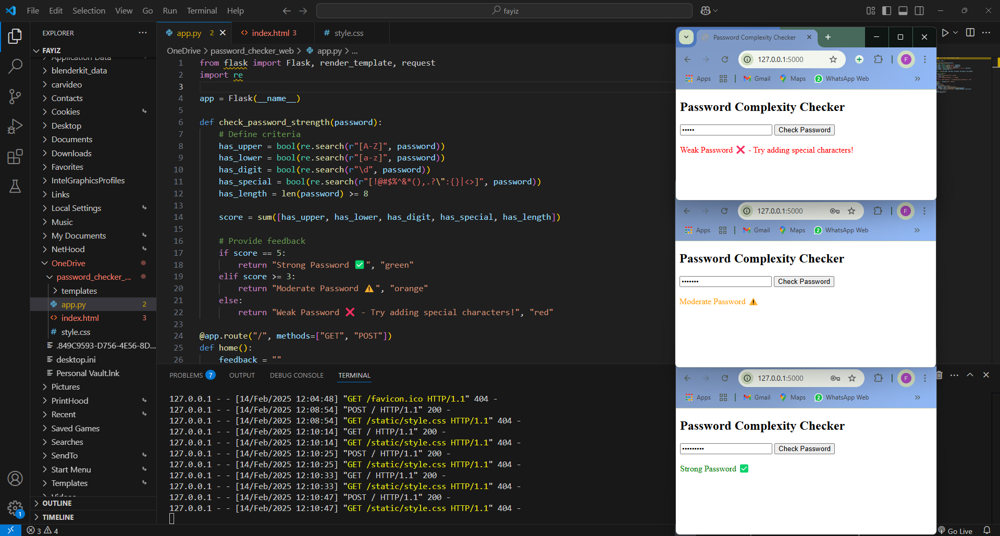

# 🔐 Password Complexity Checker

A simple and interactive web app that evaluates password strength using Flask.

## 🚀 Features
✅ Checks for uppercase, lowercase, digits, special characters & length (8+).
🎨 Color-coded feedback:
   - 🟢 **Strong Password** ✅
   - 🟠 **Moderate Password** ⚠️
   - 🔴 **Weak Password** ❌
📌 User-friendly interface.

## 🛠 Tech Stack
- **Backend:** Flask (Python)
- **Frontend:** HTML, CSS
- **Logic:** Regular Expressions (Regex)

## 📦 Setup & Run
```bash
# Clone repo
git clone https://github.com/your-username/password-checker.git
cd password-checker

# (Optional) Create & activate virtual environment
python -m venv venv
source venv/bin/activate  # Windows: venv\Scripts\activate

# Install dependencies
pip install flask

# Run the app
python app.py
```
Access the app at **`http://127.0.0.1:5000/`**.

## 📂 Project Structure
```
password-checker/
│-- templates/
│   ├── index.html
│-- static/
│   ├── style.css
│-- app.py
│-- README.md
```

## 📸 Preview


## 📜 License
Licensed under the **MIT License**.

